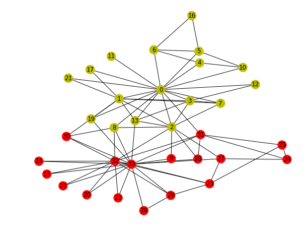
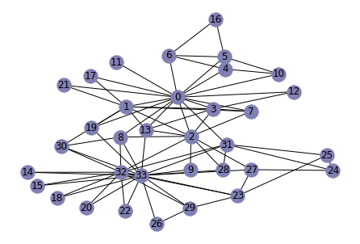
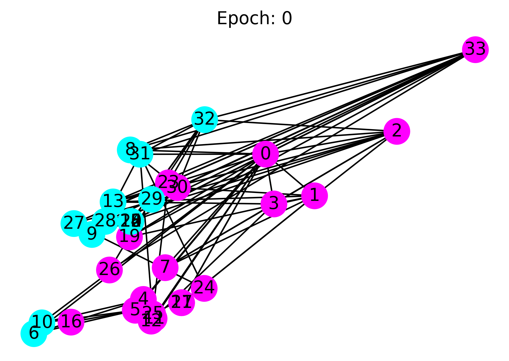
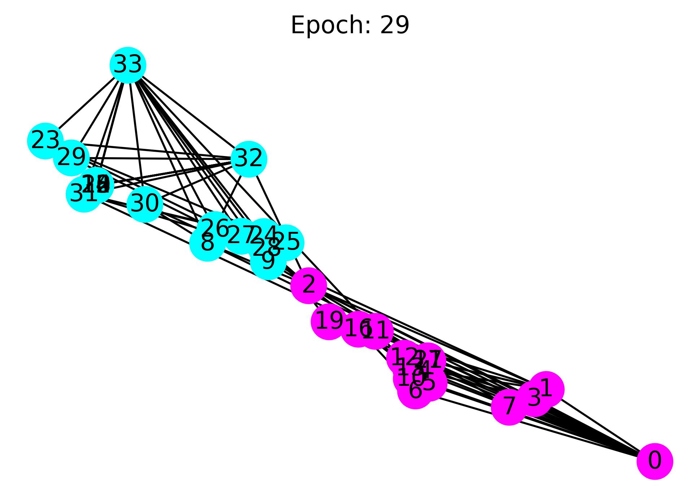

# Implementation to GCN with DGL

Author: Minjie Wang, Quan Gan, Jake Zhao, Zheng Zhang

Translated by **Mars** at 2019/8/2 10:00

DGL是一个专门用于图深度学习的Python包，构建在现有的DL框架（例如Pytorch，MXNet）之上，并简化了基于图的神经网络的实现。

本教程的目标：

- 了解DGL如何在高层次上支持图的计算；
- 在DGL上训练一个简单的图神经网络来对图中的节点进行分类。

在本教程结束时，我们希望您能够简单了解DGL的工作原理。本教程前提假定基本了解PyTorch。

# 0 Problem description

Zachary网络是通过对一个美国大学空手道俱乐部进行观测而构建出的一个社会网络，网络包含 34 个节点和 78 条边。

网络中的每个节点分别表示某一个俱乐部成员，节点间的连接表示两个成员经常一起出现在俱乐部活动（如空手道训练、俱乐部聚会等）之外的其他场合，即在俱乐部之外他们可以被称为朋友。调查过程中，该俱乐部因为主管John A.（节点33）与教练Mr. Hi（节点0）之间的争执而分裂成2个各自为核心的小俱乐部，不同颜色与形状的节点代表分裂后的小俱乐部成员。

```python
from IPython.display import Image
Image(filename="karate-club.png", width=400, height=400)
```





任务是根据社交网络预测每个成员（node）倾向于加入哪一方（0或33）。

# 1 Creating a graph in DGL

如下为Zachary的空手道俱乐部创建graph：

```python
import dgl

# 构建空手道俱乐部网络图
def build_karate_club_graph():
    g = dgl.DGLGraph()
    
    # add 34 nodes into the graph; nodes are labeled from 0~33
    g.add_nodes(34)
    
    # all 78 edges as a list of tuples
    edge_list = [(1, 0), (2, 0), (2, 1), (3, 0), (3, 1), (3, 2),
        (4, 0), (5, 0), (6, 0), (6, 4), (6, 5), (7, 0), (7, 1),
        (7, 2), (7, 3), (8, 0), (8, 2), (9, 2), (10, 0), (10, 4),
        (10, 5), (11, 0), (12, 0), (12, 3), (13, 0), (13, 1), (13, 2),
        (13, 3), (16, 5), (16, 6), (17, 0), (17, 1), (19, 0), (19, 1),
        (21, 0), (21, 1), (25, 23), (25, 24), (27, 2), (27, 23),
        (27, 24), (28, 2), (29, 23), (29, 26), (30, 1), (30, 8),
        (31, 0), (31, 24), (31, 25), (31, 28), (32, 2), (32, 8),
        (32, 14), (32, 15), (32, 18), (32, 20), (32, 22), (32, 23),
        (32, 29), (32, 30), (32, 31), (33, 8), (33, 9), (33, 13),
        (33, 14), (33, 15), (33, 18), (33, 19), (33, 20), (33, 22),
        (33, 23), (33, 26), (33, 27), (33, 28), (33, 29), (33, 30),
        (33, 31), (33, 32)]
    
    # add edges two lists of nodes: src and dst
    src, dst = tuple(zip(*edge_list))
    g.add_edges(src, dst)
    # edges are directional in DGL; make them bi-directional
    g.add_edges(dst, src)

    return g
```

可以查看所构建图的node以及edge的数目：

```python
G = build_karate_club_graph()
print('We have %d nodes.' % G.number_of_nodes())
print('We have %d edges.' % G.number_of_edges())
```

```
We have 34 nodes.
We have 156 edges.
```

利用networkX来可视化所构建的图：

```python
%matplotlib inline
import networkx as nx

# Since the actual graph is undirected, we convert it for visualization purpose.
nx_G = G.to_networkx().to_undirected()

# Kamada-Kawaii layout usually looks pretty for arbitrary graphs
pos = nx.kamada_kawai_layout(nx_G)
nx.draw(nx_G, pos, with_labels=True, node_color=[[.5, .5, .7]])
```



# 2  Assign features to nodes or edges

图神经网络将node和edge的特征结合起来进行训练。对于我们的分类任务，设定每个node的输入特征为一个one-hot向量：node $v_i$的特征向量为$[0, ..., 1, ..., 0]$，其中$i^{th}=1$。

在DGL中，我们可以同时为所有node添加特征，使用特征张量沿着第一维对node特征进行批处理。下面的代码为所有node添加了one-hot特征:

```python
import torch

G.ndata["feat"] = torch.eye(34)
```

打印node的特征以验证：

```python
# print out node 2's input feature
print(G.nodes[2].data["feat"])

# print out node 10 and 11's input features
print(G.nodes[[10, 11]].data["feat"])
```

# 3 Define a Graph Convolutional Network (GCN)

为了进行分类，我们使用了[Kipf和Welling](https://arxiv.org/abs/1609.02907)的图卷积网络(GCN)。下面是GCN的简单定义：

- 对于第$l$层，每个node $v_{i}^{l}$都有自己的特征$h_{i}^{l}$，设这些node的特征组成一个$N*F^{0}$维的特征矩阵$X$。其中$N$是node的个数，$F^0$是每个node特征表示的维度（输入层）；

- 每个node之间的关系也会形成一个$N*N$维的矩阵$A$，例如：邻接矩阵（Adjacency Matrix）。

在每一层，使用激活函数聚合这些特征以形成下一层的特征。GCN的上述定义符合**message-passing**:每个node都将使用从邻近node发送的信息来更新自己的特性。下图显示了一个图形化的演示：

```python
Image(filename="mailbox.png", width=400, height=400)
```

下面使用DGL，PyTorch实现GCN层：

```python
import torch.nn as nn
import torch.nn.functional as F

# Define the message & reduce function
# NOTE: we ignore the GCN's normalization constant c_ij for this tutorial.
def gcn_message(edges):
    # The argument is a batch of edges.
    # This computes a (batch of) message called 'msg' using the source node's feature 'h'.
    return {'msg' : edges.src['h']}

def gcn_reduce(nodes):
    # The argument is a batch of nodes.
    # This computes the new 'h' features by summing received 'msg' in each node's mailbox.
    return {'h' : torch.sum(nodes.mailbox['msg'], dim=1)}


# Define the GCNLayer module
class GCNLayer(nn.Module):
    def __init__(self, in_feats, out_feats):
        super(GCNLayer, self).__init__()
        self.linear = nn.Linear(in_feats, out_feats)

    def forward(self, g, inputs):
        
        # g is the graph 
        # inputs is the input node features
        
        # 首先设置node特征
        g.ndata['h'] = inputs
        
        # 向邻接node发送
        g.send(g.edges(), gcn_message)
        # 接收邻接node的发送
        g.recv(g.nodes(), gcn_reduce)
        
        # 获取进过图卷积后的node特征
        h = g.ndata.pop('h')
        
        # perform linear transformation
        return self.linear(h)

```

通常，node通过*message functions*发送信息，并使用*reduce functions*聚合接收到的信息。

然后，我们定义了一个包含两个GCN层的深层GCN模型：

```python
# Define a 2-layer GCN model
class GCN(nn.Module):
    def __init__(self, in_feats, hidden_size, num_classes):
        super(GCN, self).__init__()
        self.gcn1 = GCNLayer(in_feats, hidden_size)
        self.gcn2 = GCNLayer(hidden_size, num_classes)

    def forward(self, g, inputs):
        h = self.gcn1(g, inputs)
        h = torch.relu(h)
        h = self.gcn2(g, h)
        return h

```

```python
# The first layer transforms input features of size of 34 to a hidden size of 5.
# The second layer transforms the hidden layer and produces output features of size 2, corresponding to the two groups of the karate club.
net = GCN(34, 5, 2)

```

# 4 Data preparation and initialization

使用one-hot来初始化node特征。 由于是半监督学习，因此仅向教练（节点0）和俱乐部主席（节点33）分配label，如下：

```python
inputs = torch.eye(34)
labeled_nodes = torch.tensor([0, 33])
labels = torch.tensor([0, 1])

```

# 5 Train then visualize

训练与其他PyTorch模型完全相同：

1. 定义一个优化器；
2. 将输入提供给模型；
3. 计算损失；
4. 使用反向传播来优化模型。

```python
optimizer = torch.optim.Adam(net.parameters(), lr=0.01)
all_logits = []

for epoch in range(30):
    
    optimizer.zero_grad()
    
    # 前向传播
    logits = net(G, inputs)
    
    all_logits.append(logits.detach())
    
    # Softmax
    logp = F.log_softmax(logits, 1)
    
    # 只计算了0 33两个有label的node的损失
    loss = F.nll_loss(logp[labeled_nodes], labels)
    
    loss.backward()
    optimizer.step()
    
    print('Epoch %d | Loss: %.4f' % (epoch+1, loss.item()))

```

这是一个相当简陋的示例，因此它甚至没有验证或测试集。相反，由于模型为每个节点node大小为2的输出向量，我们可以通过在2D空间中绘制输出向量来进行可视化。以下代码将训练过程从初始（其中node根本没有正确分类）到结束（node可线性分离）做可视化展示。

```python
import matplotlib.animation as animation
import matplotlib.pyplot as plt

def draw(i):
    cls1color = '#00FFFF'
    cls2color = '#FF00FF'
    pos = {}
    colors = []
    for v in range(34):
        pos[v] = all_logits[i][v].numpy()
        cls = pos[v].argmax()
        colors.append(cls1color if cls else cls2color)
    ax.cla()
    ax.axis('off')
    ax.set_title('Epoch: %d' % i)
    nx.draw_networkx(nx_G.to_undirected(), pos, node_color=colors,
            with_labels=True, node_size=300, ax=ax)

```

观察训练开始前的各个node的分类情况：

```python
nx_G = G.to_networkx()
fig = plt.figure(dpi=400)
fig.clf()
ax = fig.subplots()
draw(0)  # draw the prediction of the first epoch
plt.show()

```



再观察训练结束后各个node的分类情况，可以看到两类node已被线性分离：

```python
fig = plt.figure(dpi=400)
fig.clf()
ax = fig.subplots()
draw(29)  # draw the prediction of the last epoch
plt.show()

```


